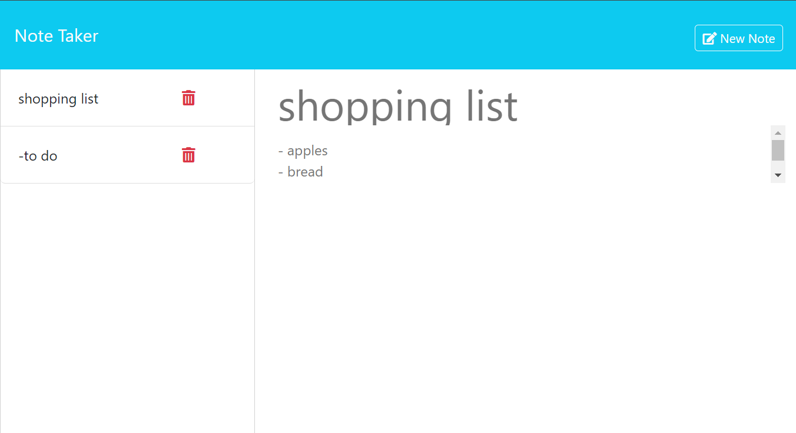

# Note Taker

## Overview
Welcome to the Small Business Note Taker, a user-friendly application designed to assist small business owners in organizing thoughts and keeping track of tasks. This application provides a straightforward interface for creating, saving, and managing notes efficiently.

## Table of Contents
- [Overview](#overview)
- [Getting Started](#getting-started)
- [Features](#features)
- [Contributing](#contributing)
- [Tests](#tests)
- [License](#license)
- [Questions](#questions)

## Getting Started
link to webpage: [Note Taker](https://note-taker-brry.onrender.com).

* Reference the features section below for an in depth look of what Note Taker is capable of.

## Features

Landing Page
* Upon opening the Note Taker, users are presented with a landing page featuring a link to access the notes page.

Notes Page
* Clicking the link to the notes page reveals a user-friendly interface.
* Existing notes are listed in the left-hand column.
* The right-hand column provides empty fields for entering a new note title and text.

Creating a New Note
* Users can effortlessly enter a new note title and text.
* As they input information, "Save Note" and "Clear Form" buttons dynamically appear in the navigation at the top.

Saving a Note
* Clicking the "Save Note" button stores the entered note.
* The new note promptly appears in the left-hand column with existing notes.
* Navigation buttons disappear after the note is saved.

Editing Existing Notes
* Clicking on an existing note in the left-hand column displays it in the right-hand column.
* A "New Note" button appears in the navigation, allowing users to easily create additional notes.

Clearing Form
* The "Clear Form" button enables users to reset the note entry fields.

## Contributing
Thank you for considering contributing to our project! Follow these steps:

* Fork the repository and clone it to your local machine.
* Create a branch, make your changes, and commit them with a clear message.
* Push your changes to your forked repository.
* Open a pull request on the original repository.

Guidelines
* Follow existing code style and conventions.
* Ensure your code is well-documented.

Pull Requests
* Keep them focused and provide a clear description.
* Reference relevant issues if applicable.

## Tests
Follow these steps to clone the repository, install necessary packages, and run the server locally:

Clone the Repository
* Clone the repository to your local machine using the following command: git clone (copied https/ssh)

Install Dependencies
* Navigate to the project directory in your terminal and Install the required Node.js packages using npm: npm install express fs
* This command installs the express and fs packages required for the project.

Run the Server
* Start the server by running the following command: node server.js
* This command will start the server and it should be running at http://localhost:3002/.
* You should now be able to view the webpage served by the application.

## License

This project is not licensed and is provided as-is without any warranty. You are free to use, modify, and distribute the code as you see fit. However, we do not provide any legal protection or support for this project.

## Questions
For questions about this project, contact [prappleman](https://github.com/prappleman) via email at parker.rappleye1@gmail.com.
